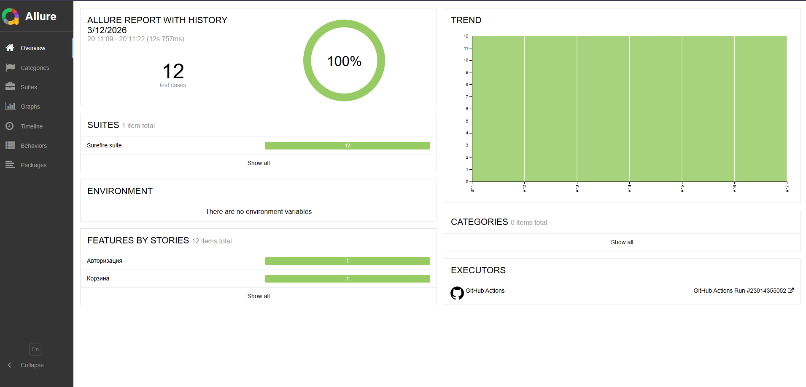
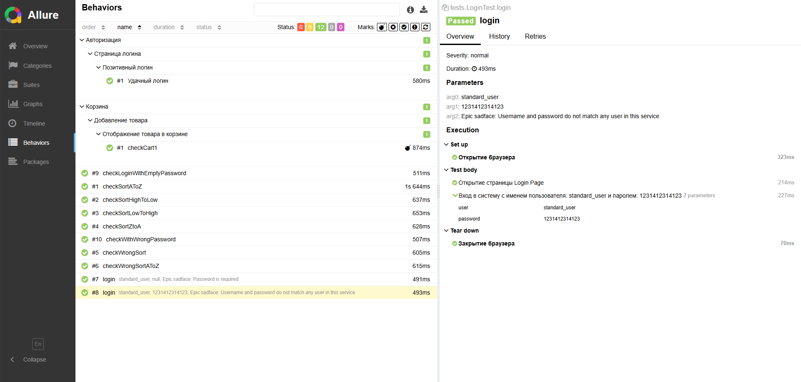

# SauceDemo UI Test Automation

Educational project demonstrating UI test automation for the website  
https://www.saucedemo.com/

The project implements a test automation framework using Java, Selenium WebDriver and TestNG.

---

## Tech Stack

- Java
- Selenium WebDriver
- TestNG
- Maven
- Allure Reports
- Log4j2
- Jenkins
- GitHub Actions

---

## Framework Features

- Page Object Model (POM)
- Cross-browser testing
- Retry failed tests
- TestNG Listeners
- Logging with Log4j2
- Allure reporting
- CI/CD integration with GitHub Actions and Jenkins

---

## Test Scenarios

The framework covers the following functionality:

### Authorization
- Login with valid credentials

### Product Sorting
- Sort products by Name (A → Z)
- Sort products by Name (Z → A)
- Sort products by Price (Low → High)
- Sort products by Price (High → Low)

### Cart
- Add product to cart
- Remove product from cart

### Checkout
- Validate checkout process
- Verify total price calculation

A detailed checklist of test scenarios is available in:

TEST_CHECKLIST.md

---

## Project Structure
src
├── pages # Page Object classes
├── tests # Test classes
├── resources # Configuration file

---

## Run Tests

Run all tests: mvn clean test

Run specific suite: mvn test -DsuiteXmlFile=SmokeTest.xml

---

## Reports

Generate and open Allure report: allure serve target/allure-results

---

## CI/CD

Tests are automatically executed using:

- GitHub Actions
- Jenkins Pipeline

---

## Purpose

The goal of this project is to demonstrate practical skills in:

- UI test automation
- Selenium WebDriver
- TestNG framework
- building maintainable test frameworks
- CI/CD integration

---

## Author

Evgeny Khainiuk

GitHub: https://github.com/f0stery  
LinkedIn: https://www.linkedin.com/in/evgeny-khainiuk/